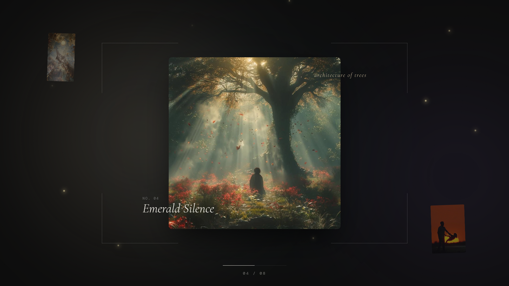

# Luminary

A cinematic, drag-driven image gallery. One image at a time. Physics-based transitions.

**Live:** https://d11vjjjvtqvjrg.cloudfront.net/

---



---

## Tech Stack

- **React 18** + **TypeScript**
- **Vite** — build tooling
- **Framer Motion** — slot-space motion, tween transitions
- **CSS Modules** — scoped styling, CSS variables
- **AWS S3 + CloudFront** — static hosting, HTTPS CDN

## Run locally

```bash
npm install
npm run dev
```

Open `http://localhost:5173`

## Controls

| Input | Action |
|---|---|
| Drag | Navigate images |
| `←` `→` | Navigate images |
| Scroll | Navigate images |
| Click corner image | Jump to that image |

## Adding images

1. Drop files (`jpg`, `png`, `webp`) into `public/images/`
2. Edit `src/data/gallery.ts` — add filename, title, and theme text per image

---

*Inspired by [Luma Dream Machine](https://www.awwwards.com/inspiration/photo-gallery-luma-dream-machine-1)*